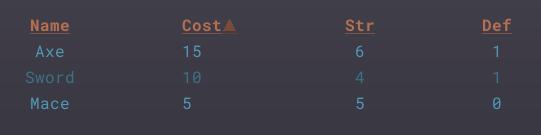

# RichText Addons - BBCode Evolved!

`v1.1`

Adds *3* new classes for *RichTextLabel*:

- *RichTextLabel2* - The base class.
- *RichTextLabelAnimation* - For text that animates in and out.
- *RichTextTable* - Table with sortable columns.

# RichTextLabel2
- Input a `font` name and `size`, and it will auto create and apply *DynamicFonts*. (Font's should be in a `res://fonts/` folder.)
- Close any tag with a simple `[]`. Close all open tags with `[/]`.
- Put multiple tags inside a single bracket, using `;` to seperate: `[b;red]Bold Red Text.[]`
- Use any `ColorN` name as a tag. `[aquamarine]My Aquamarine text[] and my [coral]Coral text[].`
- Comma seperated color tag allowed: `[1,0,0,1]Red text[]`. Useful with Godot string formatting: `"[%s]This text is red[]" % Color.tomato`
- Markdown:
    - `*italic*` = `[i]italic[]`
    - `**bold**` = `[b]bold[]`
    - `***bold italic***` = `[bi]bold italic[]`
    - `~~strike through~~` = `[s]strike through[]`
- `[if] [elif] [else] [endif]` tags: `[if not name]Hello, stranger.[elif is_enemy()]Get lost.[else]Hello, friend.[endif]`
- `[$]` expression tag. Can include styling. Self closing.: `Final score for [$player_name;b;green]: [$commas(score+bonus_points*2000);yellow;i].`
- Auto open/close quotations: `"My quote."` becomes `“My quote.”`
- 11 animations: (Automatically *installed* on use.)
    - `[cuss]` for swear words.
    - `[heart]` for love.
    - `[jit]` for nervousness.
    - `[jit2]` for nervousness (letter based).
    - `[jump]` for happiness.
    - `[jump2]` for happiness (letter based).
    - `[l33t]` for hackers.
    - `[rain]` for sadness.
    - `[sparkle]` for special keywords.
    - `[uwu]` for jueveniles.
    - `[woo]` for the immature.
- New tags:
    - `[dim]` `[dim2]` `[dim3]` Darkens by 33%, 50%, 66%.
    - `[lit]` `[lit2]` `[lit3]` Lightens by 33%, 50%, 66%.
    - `[opp]` `[tri1]` `[tri2]` Complimentary colors, to whatever is being used.
    - `[hide]` Make text transparent. Good for spacing.
    - `[em=icon]` Inserts an image scaled to the font size.
    - `[cap]` Capitalize all words.
    - `[upper]` Uppercase all letters.
    - `[lower]` Lowercase all letters.

# RichTextLabelAnimation
- New tags:
    - `[w]` or `[wait]` (self closing) Wait 1.0 second. `[wait=2]` will wait 2 seconds.
    - `[h]` or `[hold]` (self closing) Pause animation until `play()` is called again.
    - `[p]` or `[pace=n]` Set animation speed scale. 1 = default.
    - `[!]` Command tag. Will emit_signal `command` with whatever follows `!`: `Wait a minute[!play_animation("shock")], you can't say that!`
- 7 animations:
    - `[back]` Bounce into place.
    - `[console]` Typed out like a computer console.
    - `[fader]` Simply fade in.
    - `[focus]` Fly in from all angles.
    - `[prickle]` Fade in at different rates. (Set `fade_speed` low: 2 or 3)
    - `[redact]` Unredact. (Expieremental, and unstable)
    - `[wfc]` Wave function collapse. (Set `fade_speed` low: 2 or 3.)
    
# RichTextTable
- Simpler Markdown inspired formatting:

    ```
    Name|:Cost|Str|Def
    Sword|10|4|1
    Axe|15|6|1
    Mace|5|5|0
    ```
- Sortable columns.

    


# Changes
## 1.1
- Added `[if][elif][else][endif]` tags for including logic.
- Added `[$]` expression tag.
- Added `[hue=n][sat=n][val=n]` tags for tweaking colors.
- Changed emoji tag: `[em=icon]`. (Assumes file format.)
